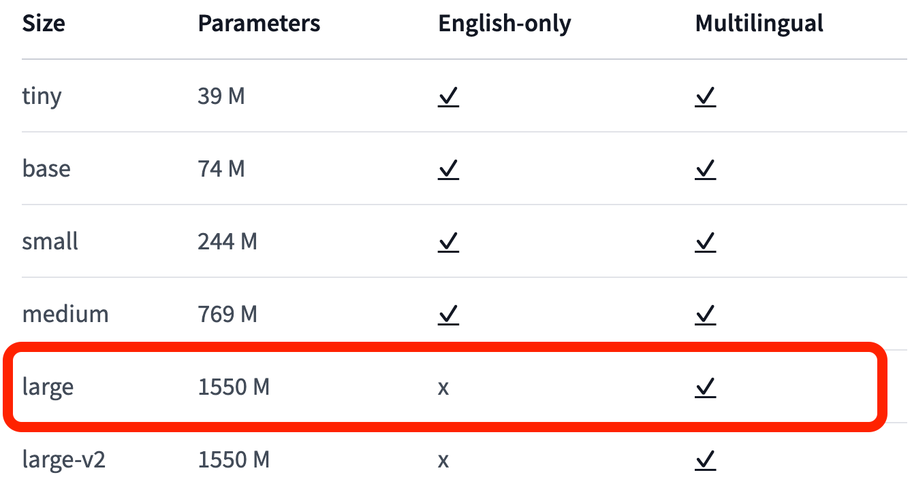

# whisper_hindi

## This repository contains the implementation of Whisper-Large ASR model on the Gramvaani and Kathbath dataset for evaluation

-The scripts for running the evaluation for the datasets are present here :
-Kathbath [here](/kathbath_hindi_eval)

-Gramvaani [here](/gramvani_hindi_eval)

## The model used for the evaluation purposes is the Whisper-Large by OpenAI
> 